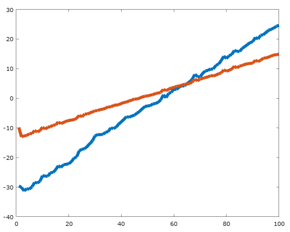

# Recurrent Weighted Average

This is a re-implementation of the architecture described in [Machine Learning on Sequential Data Using a Recurrent Weighted Average](https://arxiv.org/abs/1703.01253).

# Hypotheses

As the sequence gets longer and longer, the running average could become more and more "saturated" (i.e. new time-steps matter less and less). This might cause the network to have more and more trouble forming short-term memories as the sequence goes on. As a result, the network might do poorly at precise tasks like text character prediction.

If the above concern is actually an issue, perhaps the long-term benefits of RWAs could still be leveraged by stacking an RWA on top of an LSTM.

# Results

I created a [char-rnn branch](https://github.com/unixpickle/char-rnn/tree/rwa) that uses RWA. The results exceeded my expectations.

In this experiment, a two-layer RWA with 512 hidden units per layer is trained to predict the next character in a string. In particular, strings are random 100-byte sequences taken from [Android app descriptions](https://github.com/unixpickle/appdescs). These strings may be taken from *anywhere* within a description: mid-sentence, mid HTML tag, etc.

Quantitatively, the network achieves a cross-entropy loss of around 1.4 nats per byte (with virtually no overfitting). This will gain more meaning after I train an LSTM on the same task. Still, from my experience, I know that this is a fairly good loss for the data set in question. I trained the network for 8.9 epochs (about 80K batches of 32 samples each). This took ~10 hours on a Titan X GPU.

Qualitatively, we can look at some strings generated by the trained model:

```
id that you. The tourist now! If you is not eurislicy of kids7 rin cluide free!
</p><p>Complete whil
```

```
ifmills for your own phone Backbook Do Ore can egen  Process.</p><p></p><p></p><
p></p><p></p><p></p>
```

```
S Provide you will be sticker applications that you have to your account!<br/>No
graphy conversation
```

Those strings are being generated character-by-character. It's clear that the model has learned to spell some pretty long words (e.g. "applications"). It also knows some HTML!

So, how does the RWA do it? Modeling text like this requires the ability to model short-term dependencies as well as long-term ones. To figure out what the model was doing, I plotted the maximum and mean context weight (in the log domain) at each timestep in a sequence. Here's what I saw:

Mean log-weight:



Max log-weight:


In the above graphs, the red line is for the first layer (which sees inputs), and the blue line is for the second layer (which feeds outputs to the softmax layer). As you can see, the mean weight increases monotonically throughout the sequence. This explains how the network is able to model short-term dependencies.
